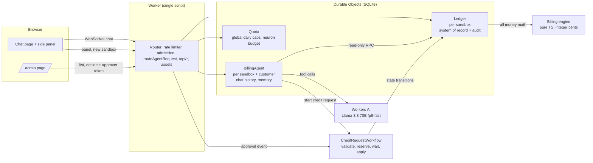

# cf-billing-copilot

A billing copilot for a customer of a usage-based cloud product, running entirely on Cloudflare.
It explains invoices, changes and plan options from a deterministic billing engine (the model
picks tools and explains; it never does the arithmetic), spots a usage spike on its own, and turns
"I was double-charged" into a credit request that a Workflow validates against the ledger and holds
for a human approver, with every step in an append-only audit trail.

**[Live demo][demo]**: synthetic data; each browser gets its own sandbox. Built on Workers AI
(Llama 3.3), Durable Objects with SQLite, Workflows and Workers static assets.

## Demo in five steps

Velvet Comet Workshop is selected; its September invoice is $412.87.

1. **Explain my invoice.** Click "Explain my September invoice": every line with its amount, each
   tool call marked "Source verified", and the September 18 spike (5x, about $11.60) flagged
   unprompted. Stories 1 and 4.
2. **What changed.** Click "What changed since August?": $299.18 to $412.87, up 38%, by product.
   Story 2.
3. **Plan simulation.** Click "What would I pay on Pro?": the same usage re-rated on Pro, with both
   totals and the difference. Story 3.
4. **Credit request.** Click "I was double-charged. Can I request a credit?", confirm the dialog
   (it names the real invoice), then click Refresh in the side panel: Pending Approval for $412.87,
   with `credit_requested`, `credit_validated` and `memo_pending` in the audit trail. Story 5.
5. **Approve and come back.** Click "Approver view", give a reason, approve: the card turns Applied
   by itself. Back in the chat, Refresh shows `credit_approved` and `credit_applied`. Reload and ask
   "What's the status of my credit request?": the copilot remembers it. Stories 5 and 6.

The credit story is a duplicated debit: the September invoice charge posted twice by a billing run
retried without an idempotency key, remedied by a credit memo. A duplicated card payment would be a
refund instead, which is out of scope. The seed also holds one historical request that expired
after 24 hours without a decision, so the timeout path is visible without waiting a day.

## Contents

- [Cloudflare components](#cloudflare-components)
- [How this was built](#how-this-was-built)
- [Architecture](#architecture)
- [The LLM never does money math](#the-llm-never-does-money-math)
- [Local setup](#local-setup)
- [Deploy](#deploy)
- [Release checklist](#release-checklist)
- [Evals](#evals)
- [Cost and abuse controls](#cost-and-abuse-controls)
- [Known limitations](#known-limitations)
- [What a production billing platform needs next](#what-a-production-billing-platform-needs-next)
- [Llama 3.3 tool calls and streaming](#llama-33-tool-calls-and-streaming)
- [Links](#links)

## Cloudflare components

| Required component | How this app uses it | Code |
|---|---|---|
| **LLM: Llama 3.3 on Workers AI** | `@cf/meta/llama-3.3-70b-instruct-fp8-fast` through `workers-ai-provider` and the AI SDK. It picks among 8 typed tools (`getAccount`, `getInvoice`, `explainLineItem`, `compareInvoices`, `simulatePlan`, `detectAnomalies`, `startCreditRequest`, `getCreditRequestStatus`) and explains their results. `temperature: 0`, bounded output, a small step limit, and a neuron budget reserved before every call. | `src/agent/model.ts`, `src/agent/tools.ts`, `src/contracts/tools.ts` |
| **Workflow / coordination: Workflows and Durable Objects** | `CreditRequestWorkflow` (an `AgentWorkflow`) runs validate, reserve a pending credit memo, `step.waitForEvent` for the approver with a 24-hour timeout, then apply, reject or expire. The `Ledger` Durable Object enforces the credit state machine and idempotency; an alarm-driven sweeper recovers stuck requests. | `src/workflows/credit-request.ts`, `src/ledger/ledger.ts` |
| **User input via chat** | A React chat page and an `/admin` approval page served as Workers static assets from the same Worker. The chat talks to the agent over the Agents SDK WebSocket (`useAgentChat`); a side panel shows the invoice, credit requests and audit trail. | `src/app.tsx`, `src/ui/`, `src/admin/` |
| **Memory and state: Durable Objects with SQLite** | `BillingAgent` (`AIChatAgent`), one per sandbox and customer, keeps the conversation and a small memory (account, recent questions, open credit requests) in its SQLite storage, so a returning browser picks up where it left off. The `Ledger` Durable Object's SQLite is the system of record: plans, usage, invoices, ledger entries, credit requests, memos and the audit log. `Quota` holds the global daily caps. | `src/agent/billing-agent.ts`, `src/ledger/`, `src/quota/quota.ts` |

The ledger lives in Durable Object SQLite rather than D1 (docs/DECISIONS.md D-1): one sandbox's
ledger is one object, so every credit transition, its reservation and its audit record commit
together in one SQLite transaction (`transactionSync`), which D1 cannot do across a
read-check-write, and each sandbox is isolated by construction rather than by a filter on every
query.

## How this was built

Built with AI-assisted coding under Anna Hester's direction. Anna wrote the assignment, made the
decisions reserved to the owner (product scope, security model, cost and contract changes), each
marked 'Decided by: Anna' in docs/DECISIONS.md, while agents decided implementation details under
the written decision rights in AGENTS.md, and merged every pull request. Claude Code and Codex
agents worked in parallel lanes (architecture, billing engine, agent and Workflow, UI, evals,
release), each in its own git worktree, and every pull request was reviewed by the harness that
did not write it. Planning, decision review and independent verification of each pull request were
done in a separate Claude conversation; see the note at the top of PROMPTS.md. Every prompt is in
[PROMPTS.md](PROMPTS.md); the scrubbed raw session transcripts are in
[prompt-history/transcripts/](prompt-history/transcripts/).

Five moments where the owner made the call:

- **Confirmation on every path.** The agent lane proposed letting the eval endpoint `/turn` skip
  the customer's credit confirmation; Anna required `confirm: true` instead, so the evals exercise
  the same policy as the product
  ([D-20](docs/DECISIONS.md#d-20-credit-confirmation-on-every-path-including-turn),
  [prompt](PROMPTS.md#18-turn-confirmation-answer-a3-and-live-evidence-typed-mid-session)).
- **A debit, not a card payment.** The ledger contract's example reference for a charge was a
  card-processor charge id; Anna corrected the story to an invoice debit posted twice by a billing run, remedied
  by a credit memo, with a duplicated card payment (a refund) out of scope
  ([prompt](PROMPTS.md#11-pr-2-billing-semantics-round-typed-mid-session)).
- **`npm test` checks the harness, not the model.** Model failures are reported verdicts, not
  failing tests, and a gate's automatic fix may not change grading or recordings to improve model
  results ([decision](docs/DECISIONS.md#evals-test-harness-stability-instead-of-model-perfection),
  [prompt](PROMPTS.md#2026-09-30t145453-0700---evals-harness-verdict-tests-and-failure-analysis)).
- **A deterministic anomaly check.** The spike mention depended on Llama 3.3 choosing to call
  `detectAnomalies`, which it did not in a live run; Anna had the server run the check for every
  invoice a turn touches
  ([decision](docs/DECISIONS.md#agent-the-server-runs-the-anomaly-check-for-every-invoice-a-turn-touches),
  [prompt](PROMPTS.md#21-anomaly-determinism-and-final-review-typed-mid-session)).
- **The per-IP sandbox cap.** Raised from 5 to 20 new sandboxes per IP a day so reviewers behind
  one office address do not lock each other out, with the global cap unchanged
  ([D-7 amendment](docs/DECISIONS.md#d-7-amendment-20-new-sandboxes-per-ip-per-utc-day),
  [prompt](PROMPTS.md#37-sandbox-per-ip-cap-owner-mid-session)).

## Architecture

- **One Worker.** Static assets for the UI; `/api/*` and `/agents/*` run the Worker first. A
  per-IP rate limiter runs before any Durable Object is touched, then every sandbox-scoped route
  checks admission (the sandbox exists and the customer is seeded) before routing.
- **Sandboxes.** Each visitor gets a fresh seeded copy of the three fictional customers, so one
  reviewer's approval never changes another's demo. "Reset demo" starts a new sandbox. Idle
  sandboxes delete themselves after 7 days.
- **Who can write money.** The agent has read methods plus exactly one write, recording a
  `requested` credit request, which moves no money. Only the token-authenticated admin endpoint
  records a decision (first writer wins); only the Workflow and the Ledger's own recovery apply,
  reject or expire. No model tool can approve or apply a credit.
- **Credit flow invariants.** Idempotency keys are unique; a pending memo reserves the disputed
  charge so two requests cannot both credit it; the credit ledger entry is unique per request;
  every transition and every refused transition writes one audit record in the same transaction.

Full design: [docs/ARCHITECTURE.md](docs/ARCHITECTURE.md). Every decision and its reason:
[docs/DECISIONS.md](docs/DECISIONS.md).

## The LLM never does money math

All rating, tiers, proration, tax, invoice totals, comparisons, plan simulations, anomaly costs
and credit amounts are computed by pure TypeScript in `src/engine/`, in integer cents with one
documented rounding rule (src/engine/README.md). Amounts leave the engine as `Money`, a pair of
integer cents and the display string from `formatUsd`, so the model only ever copies a finished
string; it is never asked to add, convert or round. The UI shows `Money.display` and never formats
or computes an amount itself. The system prompt requires every number in an answer to come from a
tool result, and to say so when data is missing. Outside `src/engine/` and `formatUsd` there is no
arithmetic on amounts (the reviewer pass greps for it).

## Local setup

Requirements: a current Node.js (built and tested on Node 24) and a Cloudflare account. Workers AI
always runs remotely, so every chat message in local dev spends real neurons (docs/DECISIONS.md
DEV-12). Clone the [repository][repo], then:

    npm ci
    npm run typecheck
    npm test                      # offline: engine, agent, workflow, UI and eval replay tests
    npx wrangler login            # once, for the remote AI binding used by local dev
    VITE_BILLING_API_MODE=live npm run dev

Without `VITE_BILLING_API_MODE=live` the UI runs as a labelled fixture preview ("Seed preview")
that makes no AI calls (docs/DECISIONS.md "ui: Fixture transport and live handoff").

No secrets are needed: the approver token is generated per sandbox and only its SHA-256 is stored
(D-4).

## Deploy

The owner deploys; agents never run these.

    npm ci
    npx wrangler login
    VITE_BILLING_API_MODE=live npm run deploy

`npm run deploy` is `vite build && wrangler deploy`. The Worker, its three Durable Object classes,
the Workflow and the rate limiter are all declared in `wrangler.jsonc`; nothing is created by hand.

## Release checklist

1. **Checks on the release commit.** `npm ci && npm run typecheck && npm test` pass.
2. **Deploy.** `VITE_BILLING_API_MODE=live npm run deploy` (above).
3. **Smoke test the live UI** (about 5 model calls). Open the demo URL in a private window.
   Confirm the "Seed preview" banner is absent. Request a credit ("My September invoice debit was
   posted twice. Please request a credit for the duplicate charge."), confirm it, click Refresh in
   the side panel and check it shows Pending Approval. Open "Approver view", approve with a reason, return, click
   Refresh: Applied, with `decision_received`, `credit_approved` and `credit_applied` in the audit
   trail.
4. **Smoke test by curl** (one `/turn`, about 3 model calls). Requires `jq`.

        U=<the live demo URL from Links>
        S=$(curl -s -X POST $U/api/sandboxes); SID=$(echo "$S" | jq -r .sandboxId); TOK=$(echo "$S" | jq -r .approverToken)
        curl -s -X POST $U/api/sandboxes/$SID/customers/cus_1/turn -H 'content-type: application/json' \
          -d '{"message":"I was double-charged for my September invoice. Can I get a credit for the duplicate charge?","confirm":true}' | jq '.toolCalls[].name, .usage'
        curl -s $U/api/sandboxes/$SID/admin/credit-requests -H "authorization: Bearer $TOK" | jq '.requests[] | {id, status}'
        RID=$(curl -s $U/api/sandboxes/$SID/admin/credit-requests -H "authorization: Bearer $TOK" | jq -r '[.requests[] | select(.status=="pending_approval")][0].id')
        curl -s -X POST $U/api/sandboxes/$SID/admin/credit-requests/$RID/decision -H "authorization: Bearer $TOK" \
          -H 'content-type: application/json' -d '{"decision":"approve","reason":"smoke test"}' | jq .request.status
        curl -s $U/api/sandboxes/$SID/customers/cus_1/panel | jq '.creditRequests[] | {id, status}, [.audit[:5][] | .action]'

   Expect `startCreditRequest` among the tool calls, the request `pending_approval`, then
   `applied` within a few seconds of the approval, and `credit_applied` at the top of the audit
   trail. Also check that the admin list answers 401 without the token.
5. **Off switch.** To take the demo offline without deleting any data, disable the Worker's
   workers.dev route in the Cloudflare dashboard (the Worker's domains and routes settings).
   Enabling the route again restores it.

## Evals

**Live result: 11 of 15 cases pass (73%), deployed demo, run on 2026-10-01 (UTC)**, one full run of
15 cases and 17 turns against the live URL: 43 model calls, about 3,800 estimated neurons.

The eval set ([evals/](evals/README.md)) asks the copilot 15 questions covering all six user
stories. Every expected number is computed by calling the engine on the seed, never typed by hand,
and the grader checks that each expected value and meaning appears in the answer and that every
number in the answer traces to a tool result from the same turn.

- **The four misses are strict-grader misses, not wrong numbers.** Two answers name the September
  18 spike as a "critical anomaly" (5x, $11.60) but not with the words the grader looks for
  ("spike" or "unusual"); two say "no credits" where the grader expects "$0.00"; one tier answer
  gives 100,000 and 2,000 requests but not their 102,000 total. The grader was not loosened to pass
  them ([evals/results/](evals/results/README.md)).
- **Replay mode runs inside `npm test`**, offline, against the committed recordings: it regrades
  every active and archived recording and fails if any verdict or recording changes. It checks the
  harness, not the model: a model failure is a reported verdict, not a failing test.
- **Live mode** (`EVAL_LIVE_READY=1 EVAL_BASE_URL=<demo URL> npm run eval:live`) runs the set
  against a deployment and re-records; it stops on the first cap or budget error and never retries.

## Cost and abuse controls

The public demo runs on the Workers Paid plan with these controls (docs/DECISIONS.md D-7, D-8, D-13):

- **Model budget.** Model calls stop for the day at an estimated 50,000 Workers AI neurons per UTC
  day, reserved before each call. That is at most about $0.44 a day above the included allowance.
- **Caps.** Per sandbox per UTC day: 30 chat messages of up to 2,000 characters, 5 credit requests
  and 200 API requests. Per IP: 20 new sandboxes a day. Globally: 200 new sandboxes a day.
- **Estimated, not hard-bounded.** The caps bound abuse cost at an estimated figure (about $34 a
  month above the $5 plan with every cap saturated all month), not a hard ceiling. A request
  refused by a cap still costs one Durable Object request. Raising the per-IP cap from 5 to 20
  did not change the estimate, which already assumes the global cap of 200 new sandboxes a day is
  used up every day; it changes how few addresses can use it up (10 instead of 40).
- **Rate limiter.** A per-IP limit of 60 requests a minute to the API and agent routes runs before
  any Durable Object is called (Workers Rate Limiting binding). It is per Cloudflare location and
  approximate by design: a brake, not an accounting system.
- **Budget alert.** A $10 budget alert is set on the Cloudflare account. It only sends email; it
  does not stop anything.
- **Off switch.** Disable the Worker's workers.dev route in the Cloudflare dashboard (the Worker's
  domains and routes settings). The demo goes offline without deleting any data; enabling the
  route again restores it.

## Known limitations

- **Demo-grade approval.** The approver token is per sandbox and the requester and approver are
  the same browser, so there is no separation of duties. The token travels in the `/admin` link's
  URL fragment (never sent to the server) and is kept in localStorage. Production would put
  `/admin` behind Cloudflare Access with SSO, record the approver's identity, and forbid a
  requester from approving their own credit (D-4).
- **Sandboxes are not accounts.** Anyone holding a sandbox id can read that sandbox's synthetic
  panel. A production system keys the agent by authenticated account and shards the ledger per
  billing account.
- **Fixed synthetic calendar.** The seed's history is dated September and October 2026 and does
  not move with the clock, so the historical expired request can carry a deadline later than a
  request made today.
- **No token streaming.** Answers appear a step at a time rather than word by word, because tool
  calls need simulated streaming on Llama 3.3 (below).
- **The model can still be wrong in words.** Amounts come from tools, but the model can miscount
  or misdescribe (for example the number of invoice lines), and it may try a tool with an invented
  id before looking the real one up; the tool rejects the bad input and the customer must confirm
  every credit request.
- **One currency, one simplified tax rate**, monthly invoices, no payments processor, no refunds.

## What a production billing platform needs next

- **Metering at scale.** An idempotent usage ingestion pipeline (Queues or Pipelines into R2 and
  an analytics store), late and corrected usage handling, and rating that runs incrementally
  instead of re-rating a month in memory.
- **Ledger and reconciliation.** A double-entry ledger per billing account, daily reconciliation
  jobs between usage, invoices, the ledger and the payment processor, and alerts on drift.
- **Revenue recognition** that turns invoices and credits into recognised revenue by period and
  feeds the general ledger.
- **Tax engine integration** (jurisdiction, exemption certificates, credit-note tax reversal)
  instead of one flat rate.
- **Approvals and controls.** SSO-backed approvers, separation of duties, amount thresholds that
  need a second approver, and audit exports.
- **SLOs and operations.** Invoice correctness and timeliness SLOs, Workflow backlog and
  stuck-request alerts, replayable recovery, and dashboards on credit volume and model spend.
- **Customer scale.** Multi-currency, plan migrations mid-cycle at volume, dunning, and data
  retention rules per region.

## Llama 3.3 tool calls and streaming

With native streaming (`streamText` straight through `workers-ai-provider`), Llama 3.3's tool-call
arguments arrived garbled and the tool never ran. The Stop 2 round trip recorded arguments like:

    {"customerId": "{"customerId": "cuscus_ac_acme"}me"}

(from the Stop 2 scaffold tool, which took a `customerId`; docs/DECISIONS.md DEV-16). It failed
the same way on the pinned versions (`workers-ai-provider` 3.3.1 with `ai` 6) and on the newest
then available (4.0.0 with `ai` 7), while non-streaming `generateText` worked on both. The fix is
the AI SDK's `simulateStreamingMiddleware`: one non-streaming call per step, replayed to the chat
as a stream, which keeps `streamText` and `AIChatAgent` working (D-14). The cost is that text
arrives a step at a time.

## Links

Every link that names the repository or the deployment is defined here, so a rename changes one
place.

- [Repository][repo]
- [Live demo][demo]

[repo]: https://github.com/annah-dev/cf-billing-copilot
[demo]: https://cf-billing-copilot.anna-hester.workers.dev

## License

MIT. See [LICENSE](LICENSE) and [THIRD_PARTY_NOTICES.md](THIRD_PARTY_NOTICES.md).
