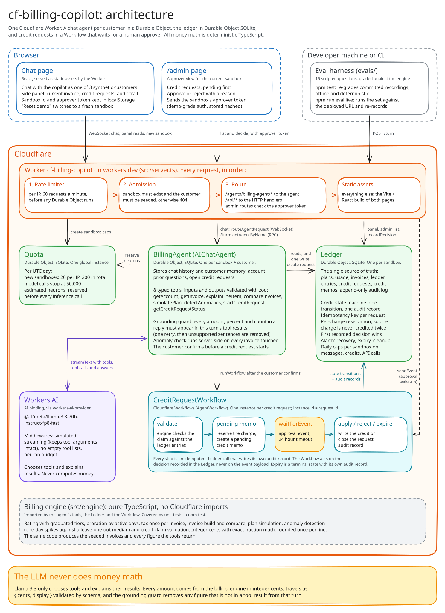
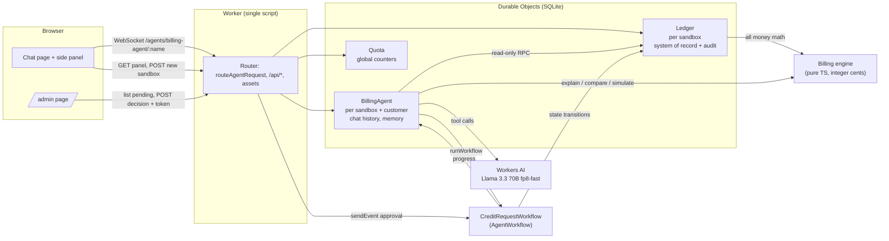
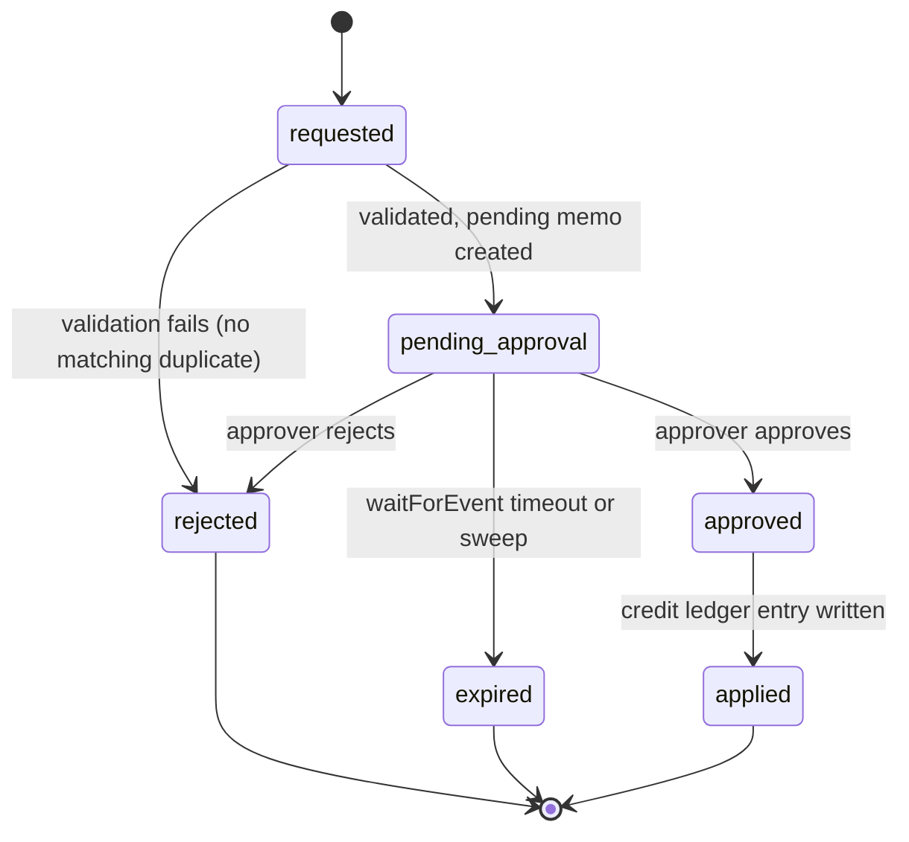
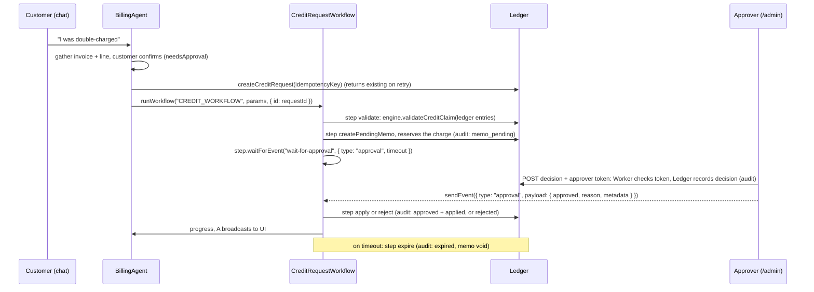

# Architecture

Diagram source: [architecture.excalidraw](architecture.excalidraw), which opens at excalidraw.com
(File, Open). The Mermaid diagrams below describe the same design in text.

cf-billing-copilot is one Cloudflare Worker. It serves a chat UI and an admin page as static assets,
hosts a chat agent per customer as a Durable Object, keeps the billing ledger in Durable Object
SQLite, and runs credit requests through a Cloudflare Workflow that waits for a human approver.
All money math happens in a pure TypeScript billing engine. The model (Llama 3.3 on Workers AI)
only chooses tools and explains their results.

Status: the design as of the Stop 2 foundation (scaffold, contracts and bindings in place, lanes
not yet built). The reasoning behind each choice is in docs/DECISIONS.md.

## Components

| Component | Cloudflare primitive | Responsibility |
|---|---|---|
| Worker entry (`src/server.ts`) | Worker | Applies the per-IP rate limiter first, then routes `/agents/billing-agent/*` (and only that namespace) to the chat agent through `routeAgentRequest`, `/api/*` to the HTTP handlers, everything else to static assets. |
| `BillingAgent` | Durable Object (SQLite), `AIChatAgent` from `@cloudflare/ai-chat` | One instance per (sandbox, customer). Holds conversation history and customer memory (account context, prior questions, open credit request ids). Runs the Llama 3.3 tool loop. Reads the ledger, never writes money. Starts credit requests. |
| `Ledger` | Durable Object (SQLite) | One instance per sandbox. The single source of truth: plans, tiers, usage, invoices, ledger entries, credit requests, credit memos, append-only audit log. Enforces the credit state machine and idempotency keys. Seeds itself from the engine's seed data. |
| `CreditRequestWorkflow` | Workflow (`AgentWorkflow` from `agents/workflows`) | validate, create pending memo, wait for the approver event (`step.waitForEvent` with an explicit timeout), apply or reject, or expire on timeout. Every transition is a Ledger call that writes an audit record in the same SQLite transaction. |
| `Quota` | Durable Object (SQLite) | One global instance. Daily counters for the public demo: new sandboxes per IP and in total, estimated Workers AI neurons per UTC day. |
| Billing engine (`src/engine/`) | none (pure TypeScript) | Rating, tiers, proration, tax, invoice build, compare, plan simulation, anomaly detection, credit claim validation. Integer cents only. No Cloudflare imports. |
| Contracts (`src/contracts/`) | none | zod schemas and types shared by every lane: money, plans, usage, ledger, invoices, tool inputs and outputs, credit requests, audit records, HTTP shapes. |
| Chat UI and `/admin` | Workers static assets | Chat page with a side panel (current invoice, credit requests, audit trail); admin page listing pending approvals with approve and reject. |
| Workers AI | `AI` binding | `@cf/meta/llama-3.3-70b-instruct-fp8-fast` through `workers-ai-provider`. |

## Tenancy: the demo sandbox

The public demo will be used by several reviewers at once, and one of them applying a credit must
not change the story for the next. Each visitor gets a sandbox (docs/DECISIONS.md, D-3):

- The first visit calls `POST /api/sandboxes`. The Worker creates a random 128-bit sandbox id and an
  approver token, seeds a `Ledger` instance named by the sandbox id, and returns both. The browser
  keeps them in localStorage, so memory survives reloads and later visits from the same browser.
- `BillingAgent` instances are named `<sandboxId>.<customerId>`. `Ledger` instances are named
  `<sandboxId>`. Every sandbox holds its own copy of the 3 seeded customers.
- "Reset demo" creates a new sandbox and the browser switches to it (D-5). The old sandbox is
  abandoned untouched; a Durable Object alarm deletes a sandbox's storage after 7 days without
  activity, and a Workflow still waiting there simply expires its request in the old Ledger.
- New sandboxes are capped per IP (20) and globally (200) per UTC day in `Quota` (D-7 and its
  amendment).
- A production system would key the agent by authenticated account and shard the ledger per billing
  account; the sandbox is a demo construct and is labelled as such in the UI.

## Data model (Ledger SQLite)

Tables, all amounts `INTEGER` cents, all timestamps ISO-8601 UTC:

- `customers`, `plans`, `plan_tiers`, `subscriptions` (plan history, for proration)
- `usage_daily` (customer, meter, date, quantity)
- `invoices`, `invoice_lines` (materialised from the engine at seed time; immutable once issued)
- `ledger_entries` (charges, payments, credits; append-only). The seeded duplicate lives here: the
  September invoice debit posted twice, with the same billing-run posting id in `reference`, by a
  billing run that was retried without an idempotency key. A credit memo is the remedy for a
  duplicated debit; a duplicated card payment would be a refund or a credit balance instead, which
  is out of scope.
- `credit_requests` (id, idempotency_key UNIQUE, customer, invoice, disputed ledger entry, claimed
  amount, validated amount, status, workflow instance id, deadline, recorded decision)
- `credit_memos` (request id UNIQUE, disputed ledger entry, amount, status `pending | applied | void`)
- `audit_log` (seq, at, actor, action, subject, reason, before, after; insert only, no UPDATE or
  DELETE path exists in code)
- `meta` (admitted flag, seed version, approver token hash, created and last-activity times,
  per-UTC-day API request counter)
- `timers` (kind, subject, due_at): the single alarm's work queue

State machine for `credit_requests.status`:

Ledger invariants, each enforced inside one `transactionSync` and covered by tests:

- **One transition, one audit record.** Every transition is one Ledger method that checks the
  current state, writes the new state and appends the audit record in the same transaction.
- **Idempotent transitions.** A transition whose target state is already reached by the same request
  returns the recorded result without a second audit record, so a Workflow step replayed after its
  transaction committed succeeds instead of failing. A genuinely conflicting transition (approve
  after expire, apply after reject) is refused and the refusal is audited.
- **No double credit across keys.** For each disputed ledger entry, pending plus applied credit
  memos never exceed the creditable amount the engine computes for it. The pending memo is the
  reservation: `createPendingMemo` checks the sum and writes the memo atomically, so two requests
  with different idempotency keys for the same charge cannot both reserve it. A second open request
  for the same charge returns the first.
- **Money moves once.** The credit ledger entry is UNIQUE on the request id.
- **Who may write.** `BillingAgent` has read methods plus exactly one write, `createCreditRequest`,
  which records a `requested` row and moves no money. The approver's decision is written only by
  the token-authenticated admin endpoint through `recordDecision` (first writer wins). Validation,
  memo, application and expiry are Workflow or Ledger-internal (alarm) paths. No model tool can
  decide, approve or apply.

Recovery for non-terminal states, run by the Ledger alarm and covered by failure-injection tests
(including a failure after the Workflow instance is created but before `createPendingMemo`):

- `requested` for more than 5 minutes: look up the instance by the request id. No instance: create
  it. `queued`, `running`, `waiting` or `paused`: leave it. `errored` or `terminated`: `restart()` it;
  every step is an idempotent Ledger call, so re-running completed steps is safe. `complete` while
  the Ledger still says `requested`: finish through the idempotent Ledger transitions directly.
- `approved` without an applied credit: re-apply through the idempotent apply.
- `pending_approval` with a recorded decision older than 5 minutes: resend the approval event, or
  finish through the Ledger transitions if the instance is no longer waiting.
- `pending_approval` past its deadline plus 1 hour with no recorded decision: expire it.

One alarm per Durable Object: the Ledger keeps its due work in a `timers` table (request recovery,
deadlines, idle deletion), sets the alarm to the earliest due time after every change, processes all
due work when it fires and reschedules. A later timer never postpones an earlier one. The agent's
own idle deletion uses the Agents SDK scheduler, which multiplexes onto that object's alarm.

## Flows

### Chat turn

1. The UI connects to `BillingAgent` over the Agents SDK WebSocket (`useAgentChat`).
2. `onChatMessage` checks the per-sandbox caps, trims history to fit the 24k-token context, and
   calls `streamText` with Llama 3.3 wrapped in `simulateStreamingMiddleware` (native streaming
   garbles tool arguments, DEV-16), the typed tools, a bounded `maxOutputTokens` and a small step
   limit. A model middleware reserves an estimated neuron cost in `Quota` before every inference
   call, including tool continuations (input tokens estimated from the prompt, output at the
   `maxOutputTokens` bound); `Quota` grants or refuses atomically, so concurrent turns cannot
   overspend the daily stop.
3. Each tool validates its input with the contract zod schema, reads from `Ledger` over RPC, runs
   the engine, validates its output, and returns structured data.
4. The system prompt requires every number in the answer to come from a tool result, and to say
   when data is missing. The UI shows which tools were called.
5. After each call the middleware reconciles the reservation with the actual token usage.

Tools: `getAccount`, `getInvoice`, `explainLineItem`, `compareInvoices`, `simulatePlan`,
`detectAnomalies`, `startCreditRequest`, `getCreditRequestStatus`. `startCreditRequest` uses the AI
SDK `needsApproval` hook, so the customer confirms the request in the UI before a Workflow starts.
The non-streaming `/turn` endpoint follows the same policy: without `confirm: true` in its request
body it can only propose a credit request (D-20).

### Credit request

### Approval never arrives

The Workflow calls `step.waitForEvent` directly, with the SDK's approval event shape (type
`"approval"`, payload `{ approved, reason?, metadata? }`, the shape `approveWorkflow` sends), rather
than `waitForApproval`: that helper reports a rejection as a Workflow error (`step.reportError`,
then `WorkflowRejectedError`), and a rejected credit is a normal outcome with its own audit record,
not an error (DEV-15). `waitForEvent` throws when its timeout (default 24 hours) elapses; the docs
name no error class, so the Workflow wraps that one call in try/catch. The catch runs a
`step.do("expire")` that moves the request to `expired`, voids the memo and writes an audit record
with actor `system` and the reason. Workflow instance state is kept 30 days after completion on
Workers Paid, but the Ledger, not the Workflow, stays the source of truth for status. A Ledger alarm
also sweeps requests past their deadline plus a grace period, so a request whose Workflow errored
still reaches a terminal state.

Decisions are first-writer-wins and immutable. The authenticated decision endpoint calls the Ledger's
`recordDecision`, which succeeds only while the request is `pending_approval` with no decision
recorded, and writes the decision and a `decision_received` audit record in one transaction. An
identical retry returns the recorded decision; a conflicting one gets HTTP 409 and an audited refusal;
a decision on an expired or finished request gets 409 (for example `approval_refused_expired`). The
approval event is only a wake-up: the Workflow and the sweeper act on the decision recorded in the
Ledger, never on the event payload, so money cannot move against the recorded decision. The expire
step checks for a recorded decision first, so a decision that lands as the wait times out is
honoured. Tests cover competing decisions and a lost event.

## HTTP surface (shapes frozen in src/contracts at Stop 2)

| Method and path | Caller | Auth | Purpose |
|---|---|---|---|
| `GET/WS /agents/billing-agent/:sandbox.:customer` | chat UI | admitted sandbox + seeded customer | Agents SDK chat channel |
| `POST /api/sandboxes` | chat UI | per-IP and global caps | create a seeded sandbox (also used by "Reset demo"), returns id and approver token |
| `GET /api/sandboxes/:sid/customers/:cid/panel` | chat UI | sandbox id | invoice, credit requests, audit trail |
| `GET /api/sandboxes/:sid/admin/credit-requests` | /admin | approver token | list credit requests, pending first |
| `POST /api/sandboxes/:sid/admin/credit-requests/:rid/decision` | /admin | approver token | approve or reject with reason |
| `POST /api/sandboxes/:sid/customers/:cid/turn` | eval harness | sandbox id, caps | one non-streaming turn, returns text and tool calls with inputs and outputs; `confirm: true` confirms a credit request started in the turn (D-20) |

Admission: a sandbox exists only if `POST /api/sandboxes` created it (the Ledger's `meta` row marks
it admitted). Before routing, every sandbox-scoped route, including the agent route through
`routeAgentRequest`'s `onBeforeConnect` and `onBeforeRequest` hooks, checks that the name is
well-formed, the Ledger is admitted and the customer is one of its seeded customers; otherwise 404.
A rejected name causes no seeding and no write, so a fabricated name costs one empty Durable Object
lookup and stores nothing; only `POST /api/sandboxes` seeds. Tests cover fabricated sandbox ids and
customer ids.

Non-model traffic is capped too: each admitted sandbox may make 200 sandbox-scoped API requests per
UTC day (counted in the Ledger in the same call as the admission check; over the cap it answers 429
and writes nothing). Refusals are audited once per request, action and reason; repeats return the
same status without writing.

## Budgets that shape the design (Workers Paid)

- Workers AI: 10,000 neurons per day included (reset 00:00 UTC), then $0.011 per 1,000. Llama 3.3
  costs 26,668 neurons per M input tokens and 204,805 per M output tokens, so a tool-using turn is
  about 250 to 300 neurons. `Quota` stops model calls at an estimated 50,000 neurons per UTC day
  (roughly 170 to 200 turns, at most about $0.44 per day over the included amount), and per-sandbox
  caps limit any one visitor (D-7).
- Seed size: a seeded sandbox inserts about 1,250 rows (3 customers x 92 days x 4 meters = 1,104
  daily usage rows, plus about 150 rows of plans, tiers, subscriptions, invoices, lines, ledger
  entries, the historical credit request and audit records), about 2,500 rows written counting
  index updates. Deletion is billed as writes too, so a sandbox's lifecycle costs about 5,000 rows
  written. The engine lane asserts the seed's record count; the agent lane measures real rows
  written (the SQL cursor's `rowsWritten`) for seeding and deletion in an integration test that
  fails above 2,500 per phase.
- Durable Objects: 1M requests and 50M rows written per month included, then $0.15 per million
  requests and $1.00 per million rows.
- Cost estimate for accepted traffic, not a ceiling. Assume every cap is saturated all month and
  about 1,400 live sandboxes (200 new per day, the global cap, each deleted 7 days after its last
  activity; a visitor who keeps sandboxes active can exceed this, because idle deletion does not
  bound the live count). Each live sandbox writes about 800 rows a day under its caps (200 API requests at about 2
  writes, 30 chat messages at about 10, 5 credit requests at about 15), plus about 5,000 per new
  sandbox: about 2.1M rows per day, or 63M per month, about $13 over the included amount. Accepted
  requests add about $2. Workflows: 500,000 steps per month included; 1,400 x 5 x 6 x 30 = 1.26M
  steps, about $6 over. Workers AI: at most about $13 (the neuron stop is a hard daily limit). Total
  about $34 over the $5 plan. Normal demo traffic stays inside the included amounts.
- The per-IP cap of 20 new sandboxes a day does not change this estimate, because the global cap of
  200 already binds; it only means 10 addresses can use up a day's sandboxes (40 at the earlier
  cap of 5).
- Not covered by that estimate: refused traffic. The per-sandbox caps are counted inside the
  Ledger, so a call refused with 429 or 404 still costs one Durable Object request (no write).
  The per-IP `RATE_LIMITER` (60 requests a minute) runs in the Worker before any Durable Object is
  invoked and slows that traffic, but it is per location and approximate, so it is a brake, not a
  bound (D-13).
- Workflows: 30-day retention of completed instances; waiting instances do not count toward
  concurrency.

## Testing

- `npm test` is offline and deterministic: engine unit tests, agent and workflow tests in
  `@cloudflare/vitest-pool-workers` with a stubbed AI binding (Workflows via
  `introspectWorkflowInstance`, including `mockEvent` and `forceEventTimeout`), and the eval harness
  in replay mode against recorded model outputs.
- `npm run eval:live` runs the eval set against the deployed URL and re-records.
